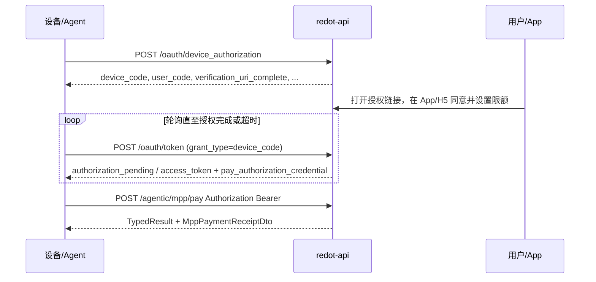

# Agentic MPP：需求变更说明与接口文档

本文档包含：**需求变更摘要**、**从设备授权到免密支付的完整 HTTP 流程**（OAuth Device + Bearer 支付）、**各接口请求/响应字段**、以及 Kafka、数据模型等集成说明。

- **Base URL**：下文用 `BASE_URL` 表示（例如本地 `http://127.0.0.1:8096`，以 `server.port` 为准）。
- **更细的扫码 ECDSA 路径**（`/pay/authorization/qr`）、**同意授权请求体**（`/pay/authorization/allow`）等见：`redotpay-api/docs/PAY_AUTHORIZATION_AND_OAUTH_DEVICE_API.md`。
- **部署步骤**见：`docs/agentic-mpp-deployment.md`。

---

## 1. 需求变更摘要


| 维度        | 变更前（概念）                               | 变更后                                                         |
| --------- | ------------------------------------- | ----------------------------------------------------------- |
| 支付成功 MQ   | api 在结算完成后曾通过本地 Producer 发 Kafka（已移除） | **仅 pay（reap）**在扣款成功后发业务消息；**api 不显式发 MQ**                  |
| 用户侧「支付成功」 | 曾与结算完成强绑定                             | **扣款成功**即可视为支付成功（`user_order`、站内/推送）；**不等待** MPP 结算完成       |
| 结算与展示     | 边界较模糊                                 | **结算**在 `agentic_mpp_payment_order` 上**独立子状态机** + CAS，防重复结算 |
| 数据库       | 无 `settlement_status`                 | 新增 `settlement_status`；脚本见 workspace `sql/`                 |


**对外契约说明**

- `POST /api/v1/agentic/mpp/pay` 的 URL、鉴权方式、请求头、`TypedResult` 包装不变。
- **响应体 `data`（Receipt）**：嵌套 `**settlement.amount` / `settlement.currency`（字符串）**，对齐 [mpp.dev/protocol/receipts](https://mpp.dev/protocol/receipts)。请求体可使用 JSON 字段 `**method`** 作为 `mppMethod` 的别名。

---

## 2. 完整端到端流程（Agentic MPP）

Agent 设备/无屏场景：**先走 OAuth 2.0 Device Authorization Grant（RFC 8628）拿到 `access_token` 与支付授权凭证，再在支付接口上携带 Bearer 调用免密支付**。




**步骤说明**

1. **申请设备码**：`POST /api/v1/oauth/device_authorization`，获得 `device_code`、`user_code`、`verification_uri_complete` 等。
2. **用户授权**：用户在手机打开 `verification_uri_complete`（App 深链或 H5），登录后**同意授权**并确认限额（服务端完成支付授权凭证签发；设备端不参与 `allow` 的登录会话调用）。
3. **轮询令牌**：`POST /api/v1/oauth/token`，`grant_type=urn:ietf:params:oauth:grant-type:device_code`，直到返回 `access_token`；成功时 Body 内带 `pay_authorization_credential`。
4. **免密支付**：`POST /api/v1/agentic/mpp/pay`，请求头 `Authorization: Bearer <access_token>`，Body 为 MPP 支付参数；成功时 `TypedResult.data` 为 Receipt。

**两种响应形态（全局）**


| 形态               | 适用接口                                                                  | Body 特征                                       |
| ---------------- | --------------------------------------------------------------------- | --------------------------------------------- |
| **OAuth 裸 JSON** | `POST .../oauth/device_authorization`、`POST .../oauth/token`（成功/部分错误） | RFC 风格字段，**无**统一 `TypedResult` 包装             |
| **TypedResult**  | `GET .../oauth/device/resolve`、`POST .../agentic/mpp/pay` 等           | `{ "code", "msg", "data" }`，业务是否成功以 `code` 为准 |


参数校验失败时，部分接口 **HTTP 仍为 200**，Body 为全局异常形态（`code`/`msg`），与 App 其它接口一致；OAuth 业务错误也可能返回 **HTTP 400** + `{ "error", "error_description" }`。

**OAuth Device 与签名（易混点）**

- **申请设备码、轮询 token**：**不需要 ECDSA**；设备用扁平 JSON 即可。
- **授权页链接**（H5 URL 上的 `data` + `signature`）：用于**防止授权页参数被篡改**，使用共享密钥做**对称签名**即可；**本仓库当前实现为 HMAC-SHA256（hex）**，配置 `pay.authorization.hmac.secret`。若与 App 约定 **MD5(secret∥data)** 等其它规则，须**与服务端生成逻辑一致**（默认代码非 MD5，改算法需同步改 `PayAuthorizationLinkService` / `HmacGenerator` 与客户端验签）。
- **扫码 QR 路径**：仍为 **ECDSA** 验签，与 OAuth Device 不同。

详见：`redotpay-api/docs/PAY_AUTHORIZATION_AND_OAUTH_DEVICE_API.md` 开篇「OAuth Device、授权页与 ECDSA」。

---

## 3. OAuth Device Flow 接口（RFC 8628）

### 3.1 与「扫码二维码授权」的差异（勿混用）


| 项目   | OAuth：`/api/v1/oauth/device_authorization`      | 扫码：`/api/v1/pay/authorization/qr`           |
| ---- | ----------------------------------------------- | ------------------------------------------- |
| 请求体  | **扁平 JSON**（`client_id`、`appName`、`deviceSn` 等） | **ECDSA**：`data`（Base64）+ `signature`（十六进制） |
| 典型场景 | Agentic、无屏设备                                    | 有设备私钥签名的扫码流程                                |


Agentic MPP 文档范围以 **OAuth 路径**为主。

---

### 3.2 `POST /api/v1/oauth/device_authorization`


| 项            | 说明                 |
| ------------ | ------------------ |
| 鉴权           | 无（`@SaIgnore`）     |
| Content-Type | `application/json` |


**请求体**


| 字段           | 类型     | 必填  | 说明                                                         |
| ------------ | ------ | --- | ---------------------------------------------------------- |
| `client_id`  | string | 是   | 客户端标识；若配置 `pay.oauth.device.allowed-client-ids`（非空），须命中白名单（常见项如 **`OpenClaw`**；tcli 默认 `client_id` 与之对齐） |
| `appName`    | string | 是   | 应用/技能名称                                                    |
| `publicKey`  | string | 否   | 可选；无设备签名场景可传 `""`                                          |
| `deviceName` | string | 是   | 设备名称                                                       |
| `deviceSn`   | string | 是   | 设备序列号                                                      |
| `timestamp`  | number | 是   | 毫秒时间戳，大于 0                                                 |
| `scope`      | string | 否   | 预留                                                         |


**成功：HTTP 200**，Body（OAuth JSON，无 TypedResult）：


| 字段                          | 说明                                                                                           |
| --------------------------- | -------------------------------------------------------------------------------------------- |
| `device_code`               | 设备侧保密，仅用于轮询 `token`                                                                          |
| `user_code`                 | 用户可读短码（如 `XXXX-XXXX`）                                                                        |
| `verification_uri`          | 配置项 `pay.oauth.device.verification-uri`                                                      |
| `verification_uri_complete` | 优先：配置 `pay.authorization.qrcode-deeplink.base-url` 非空时为 App 深链；否则为本次待授权单对应的 **H5 授权页完整 URL** |
| `expires_in`                | 秒，会话 TTL（`pay.oauth.device.expires-in-seconds`）                                              |
| `interval`                  | 秒，建议轮询间隔（`pay.oauth.device.interval-seconds`）                                                |
| `qr_code`                   | 扩展：与 `qr_code` 表业务码一致（如 `redotpay:…`），为 **App/系统可识别的 URI 字符串**（非文件路径） |

无屏设备 / CLI：应将该字符串**编入二维码图片**（PNG）供用户扫描；与旧版兼容时也可能下发 PNG 的 Base64。若未返回 `qr_code`，仍可用 `verification_uri_complete`（或 `verification_uri`）生成扫码内容。

**业务错误：HTTP 400**：`{ "error": "invalid_client", "error_description": "..." }`  
**服务端异常：HTTP 500**：`{ "error": "server_error" }`

---

### 3.3 `POST /api/v1/oauth/token`（设备轮询）


| 项            | 说明                                                           |
| ------------ | ------------------------------------------------------------ |
| 鉴权           | 无                                                            |
| Content-Type | `application/x-www-form-urlencoded` **或** `application/json` |


**参数（表单与 JSON 等价；实现会合并）**


| 字段            | 必填  | 说明                                                |
| ------------- | --- | ------------------------------------------------- |
| `grant_type`  | 是   | 固定：`urn:ietf:params:oauth:grant-type:device_code` |
| `device_code` | 是   | 上一步返回的 `device_code`                              |
| `client_id`   | 是   | 与上一步一致                                            |


**成功：HTTP 200**，Body 示例：

```json
{
  "access_token": "<opaque>",
  "token_type": "Bearer",
  "expires_in": 3600,
  "scope": "pay.authorization",
  "pay_authorization_credential": { }
}
```


| 字段                             | 说明                                               |
| ------------------------------ | ------------------------------------------------ |
| `access_token`                 | 后续 `Authorization: Bearer` 使用                    |
| `expires_in`                   | 秒，来自 `pay.oauth.device.access-token-ttl-seconds` |
| `pay_authorization_credential` | 支付授权凭证对象，结构见下节；仅轮询成功且业务返回凭证时存在                   |


**未完成或错误：HTTP 400**：`{ "error": "<code>", "error_description": "..." }`


| `error`                  | 含义                          |
| ------------------------ | --------------------------- |
| `authorization_pending`  | 用户尚未在 App/H5 完成授权           |
| `slow_down`              | 轮询过频，应加大间隔                  |
| `access_denied`          | 用户拒绝                        |
| `expired_token`          | 会话过期或 `device_code` 无效      |
| `invalid_grant`          | 如 `client_id` 与会话不一致        |
| `unsupported_grant_type` | `grant_type` 不是 device_code |
| `invalid_request`        | 缺少必填参数                      |


---

### 3.4 `GET /api/v1/oauth/device/resolve`（可选）

用于按 `user_code` 展示待授权信息（如大屏展示设备名、应用名）。


| 项   | 说明                                                       |
| --- | -------------------------------------------------------- |
| 路径  | `GET /api/v1/oauth/device/resolve?user_code=<USER_CODE>` |
| 鉴权  | 无                                                        |
| 响应  | `TypedResult<DeviceSessionPreview>`                      |


`**data` 成功时字段**


| 字段                 | 说明     |
| ------------------ | ------ |
| `appName`          | 应用名    |
| `deviceName`       | 设备名    |
| `expiresInSeconds` | 剩余有效秒数 |


---

### 3.5 `pay_authorization_credential` 结构说明

成功换取 token 时，`pay_authorization_credential` 为 **JSON 对象**（对应 `PayAuthorizationCredentialVO`），常见字段如下（以实际返回为准，服务端可能扩展）。


| 字段                                | 类型     | 说明                                   |
| --------------------------------- | ------ | ------------------------------------ |
| `uid`                             | number | 用户 id                                |
| `mid`                             | number | 商户 id                                |
| `sn`                              | string | 凭证编号                                 |
| `appName`                         | string | 应用名称                                 |
| `deviceName` / `deviceSn`         | string | 设备信息                                 |
| `publicKey`                       | string | ECDSA 公钥（若有）                         |
| `status`                          | number | 凭证状态（如 0 未授权 / 1 已授权 / 2 已过期，以服务端为准） |
| `expireAt`                        | string | 授权过期时间（ISO 日期时间，序列化形态以实际为准）          |
| `perTransactionLimit`             | number | 单笔交易限额                               |
| `dailyLimit`                      | number | 日累计限额                                |
| `beneficiary` / `beneficiaryName` | string | 收款方信息（若有）                            |


免密支付接口会校验凭证有效性与限额（见 `AgenticMppPaymentService`）。

---

### 3.6 OAuth Device 相关配置（节选）


| 配置项                                                                    | 说明                                           |
| ---------------------------------------------------------------------- | -------------------------------------------- |
| `pay.oauth.device.verification-uri`                                    | `verification_uri` 说明用落地页                    |
| `pay.oauth.device.expires-in-seconds`                                  | 设备会话 TTL（秒）                                  |
| `pay.oauth.device.interval-seconds`                                    | 建议轮询间隔（秒）                                    |
| `pay.oauth.device.access-token-ttl-seconds`                            | `access_token` 存活时间（秒）                       |
| `pay.oauth.device.allowed-client-ids`                                  | 非空时 `client_id` 白名单（逗号分隔）                    |
| `pay.authorization.qrcode-deeplink.base-url`                           | App 深链前缀；空则 `verification_uri_complete` 为 H5 |
| `pay.authorization.hmac.secret` / `pay.authorization.agentic-auth-url` | H5 授权页 `data`/`signature` 等（与扫码共用逻辑）         |


---

### 3.7 用户侧「同意授权」（非设备 Bearer 调用）

用户在 App/H5 完成登录后，通过 `**POST /api/v1/pay/authorization/allow`**（需 Sa-Token 登录态）提交限额等完成授权。设备端**不**携带 Bearer 调用该接口；设备只轮询 `/oauth/token` 直至拿到 `access_token`。

拒绝授权、扫码二维码创建等见：`redotpay-api/docs/PAY_AUTHORIZATION_AND_OAUTH_DEVICE_API.md`。

---

## 4. Agentic MPP 免密支付接口

### 4.1 `POST /api/v1/agentic/mpp/pay`


| 项                | 说明                                                          |
| ---------------- | ----------------------------------------------------------- |
| **鉴权**           | `Authorization: Bearer <access_token>`（与 OAuth Device 返回一致） |
| **幂等（可选）**       | 请求头 `X-Idempotency-Key`：相同 key 在**已成功结算**时可返回同一收据           |
| **Content-Type** | `application/json`                                          |
| **响应**           | `TypedResult<MppPaymentReceiptDto>`（成功时 `code` 一般为 200）     |


**请求体 `AgenticMppPayRequest`**


| 字段               | 类型     | 必填  | 说明                                                                                                                              |
| ---------------- | ------ | --- | ------------------------------------------------------------------------------------------------------------------------------- |
| `mppMethod`      | string | 是   | MPP 方法，如 `tempo`；JSON 可用 `**method**` 作为别名                                                                                      |
| `challengeId`    | string | 否   | 业务 challenge 标识                                                                                                                 |
| `amount`         | number | 是   | 用户应付业务金额（不含平台手续费），与授权限额校验一致                                                                                                     |
| `payVarietyCode` | string | 否   | 默认 `usdt`                                                                                                                       |
| `tempo`          | object | 否   | Tempo：`recipient`、`tokenContract`、`decimals` 等（链上路由）；**链上实际转账数量**由服务端按订单（扣款总额 − 平台手续费）计算，**不**采用客户端 `transferAmount`/根 `amount` |


**成功响应 `data`（`MppPaymentReceiptDto`）**


| 字段路径                       | 类型     | 说明                          |
| -------------------------- | ------ | --------------------------- |
| `code`                     | number | 业务码，成功一般为 200               |
| `data.challengeId`         | string | 与请求一致                       |
| `data.method`              | string | 与 `mppMethod` / `method` 对应 |
| `data.reference`           | string | 结算引用（如链上 tx）                |
| `data.settlement`          | object | 嵌套，对齐 mpp.dev receipts      |
| `data.settlement.amount`   | string | 结算数量（字符串）                   |
| `data.settlement.currency` | string | 币种或代币代码（如 `usdt`）           |
| `data.status`              | string | 如 `success`                 |
| `data.timestamp`           | string | ISO 时间（UTC）                 |


**常见错误码（节选）**


| 场景                               | 说明                         |
| -------------------------------- | -------------------------- |
| `AGENTIC_MPP_UNAUTHORIZED`       | 未带 Bearer 或 token 无效       |
| `AGENTIC_MPP_PAY_FAILED`         | 扣款失败                       |
| `AGENTIC_MPP_SETTLEMENT_FAILED`  | 结算失败（可能已进入退款）              |
| `AGENTIC_MPP_UNSUPPORTED_METHOD` | 无对应 `MppSettlementHandler` |
| `AGENTIC_MPP_LIMIT_EXCEEDED`     | 超出单笔/日限额                   |
| `PARAM_VALIDATE_FAIL`            | 参数不合法                      |


**相关配置**


| 配置项                                 | 说明                                                              |
| ----------------------------------- | --------------------------------------------------------------- |
| `pay.agentic-mpp.platform-fee-rate` | 平台手续费比例                                                         |
| pay（reap）侧                          | `bizType=AGENTIC_MPP_PAYMENT(135)`、`paymentScenarioCode` 等与配置一致 |


**DDL**：workspace `sql/agentic_mpp_payment_order.sql`、`sql/V20260415_agentic_mpp_payment_order_settlement_status.sql`

---

## 5. 非 HTTP：Kafka 与内部行为


| 项           | 说明                                                  |
| ----------- | --------------------------------------------------- |
| **消息由谁发**   | **reap** 扣款成功后发业务消息；**api 不发送**                     |
| **Topic**   | `{common.topicPre}pay-payorder-agentic-mpp-message` |
| **bizType** | `135`（`AGENTIC_MPP_PAYMENT`）                        |
| **api 消费**  | 扣款成功即可能写 `user_order`、站内/推送；**不要求**业务单已为结算完成态       |


---

## 6. 数据模型（业务单）


| 字段                                            | 说明              |
| --------------------------------------------- | --------------- |
| `agentic_mpp_payment_order.status`            | 粗粒度生命周期         |
| `agentic_mpp_payment_order.settlement_status` | 结算子状态（与 CAS 配合） |


---

## 7. 文档索引


| 文档                                                            | 内容                             |
| ------------------------------------------------------------- | ------------------------------ |
| `redotpay-api/docs/PAY_AUTHORIZATION_AND_OAUTH_DEVICE_API.md` | 扫码 ECDSA、allow/refuse 请求体、调试说明 |
| `docs/agentic-mpp-deployment.md`                              | 发布顺序、DDL、验证清单                  |
| `docs/agentic-mpp-requirements-and-api.md`                    | 本文                             |


---

## 8. 变更清单（研发）

- 删除：`AgenticMppPaySuccessProducer`（api）。
- 修改：`AgenticMppPaymentService`、`AgenticMppPaySuccessHandler`、`AgenticMppPayEventConsumer`；`MppPaymentReceiptDto` 嵌套 `settlement`；`AgenticMppPayRequest` 支持 `method` 别名。
- 新增：`settlement_status` 与 workspace `sql/` 脚本。

若需 OpenAPI/Swagger，可在 `redot-api` 对应 Controller 上补充注解后由构建导出。